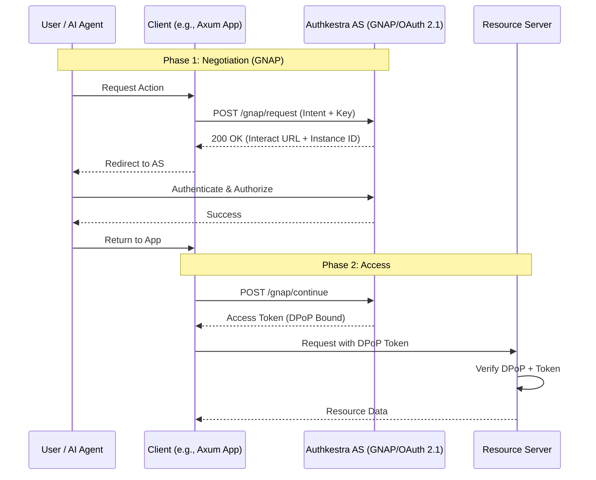

## Goal

Make the existing OAuth implementation compliant with the new architecture.

## Tasks

- Update the existing OAuth implementation to implement the `Flow` trait.
- Update providers to use the `Provider` trait.
- Ensure OAuth `state` and `nonce` are stored in encrypted cookies, never in the database.

## Acceptance Criteria

- [x] OAuth flow is refactored to implement the generic `Flow` trait.
- [x] Existing providers (GitHub, Google, etc.) implement the `Provider` trait.
- [x] OAuth sequence diagrams in docs are still valid for the new implementation.

## Definition of Done (DoD)

- [x] OAuth integration tests pass.
- [x] Verified that no state is stored in the DB during the flow.
- [x] Documentation on how to add a new provider is updated.

### Proposed Protocol Flow (GNAP/OAuth 2.1 Hybrid)

